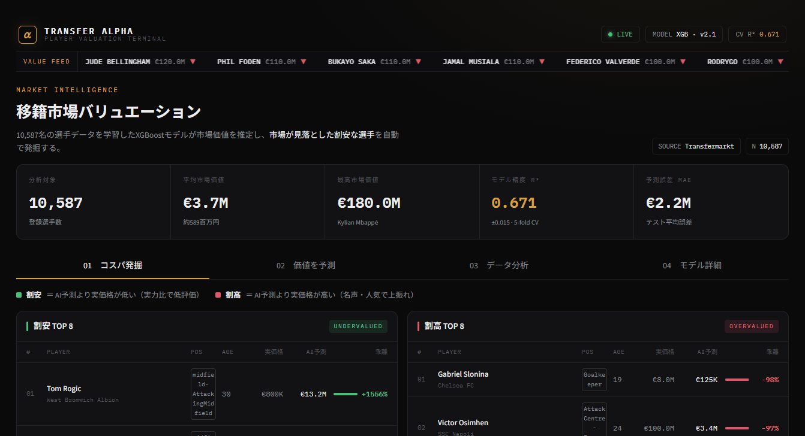

<div align="center">

# ⚽ サッカー移籍市場 AI分析ダッシュボード

**Transfermarktの選手データ 10,754名から市場価値を予測し、「実力のわりに割安な選手」を自動発掘するWebアプリAI**


<br>



</div>

---

## 📌 概要

サッカー選手の出場成績・年齢・ポジションなどから、**市場価値（移籍金）を機械学習で予測**するダッシュボード。
モデルの予測値と実際の市場価値の乖離を使い、**「実力に対して市場が過小評価している割安な選手」**を自動で抽出できる。

データソース：[Kaggle - Football Players Transfermarkt Dataset](https://www.kaggle.com/datasets/davidcariboo/player-scores)

---

## ✨ 主な機能（4タブ構成）

| タブ | 内容 |
|:---|:---|
| 💎 **コスパ選手ランキング** | AIの予測値と実価格の乖離から「割安TOP20 / 割高TOP20」を抽出。全選手の割安・割高を散布図で可視化 |
| 🔮 **移籍金を予測する** | 既存選手の適正価格をゲージで表示。スタッツを手入力したカスタム選手の市場価値も予測 |
| 📊 **データ分析** | ポジション別・チーム別の価値比較、年齢×市場価値の分布を対話的に探索 |
| 🤖 **AIモデルについて** | 特徴量重要度（価値を左右する要因TOP12）と予測精度（実際 vs 予測）を可視化 |

---

## 🧠 モデル

| 項目 | 内容 |
|:---|:---|
| アルゴリズム | **XGBoost**（回帰、n_estimators=500, max_depth=6） |
| 目的変数 | `current_value`（**log1p 変換**で右裾の歪みを補正） |
| 特徴量 | 21個（基本15 + 派生4 + カテゴリ2） |
| 評価 | **5-fold 交差検証** + 80/20 ホールドアウト |
| 精度 | 交差検証 **R² ≈ 0.67**、テスト平均誤差 MAE ≈ €2.2M |

### 派生特徴量（精度向上の工夫）
合計値ではなく **1試合あたり**に正規化し、出場数の違いを吸収：
`goals_per_game` / `assists_per_game` / `minutes_per_game` / `injury_rate`（怪我による欠場率）

---

## 🔧 技術的な工夫

- **対数変換**：市場価値は分布の右裾が極端に長いため `log1p` 変換し、外れ値に引っ張られる誤差を抑制
- **per-game 正規化**：通算成績では出場数の多いベテランが有利になるため、1試合あたりに変換して公平に評価
- **5-fold 交差検証**：単一の train/test 分割に依存しない汎化性能を評価
- **割安/割高分析**：予測と実価格の乖離（残差）を「市場の見落とし」として応用し、スカウティング観点の指標に変換

---

## 🛠️ 技術スタック

| 領域 | 技術 |
|:---|:---|
| 言語 | Python 3.14 |
| 機械学習 | scikit-learn / XGBoost |
| データ処理 | pandas / NumPy |
| UI | Streamlit |
| 可視化 | Plotly（インタラクティブ） |

---

## 🚀 セットアップ

```bash
pip install -r requirements.txt
python -m streamlit run app.py
```

ブラウザで `http://localhost:8501` が開きます。データは `data/final_data.csv` に配置してください。
（初回起動時、モデル学習に30〜60秒かかります）

---

## 📈 今後の改善

- [ ] SHAP値による個別予測の説明可能性
- [ ] LightGBM / CatBoost との精度比較
- [ ] 時系列での市場価値トレンド分析
- [ ] チーム・リーグ集約特徴量の追加
